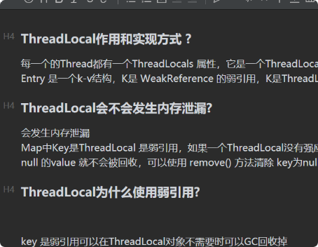

#### ThreadLocal作用和实现方式 ?

每一个的Thread都有一个ThreadLocals 属性，它是一个ThreadLocalMap的对象，本质是一个Entry数组 Entry 是一个k-v结构，K是 WeakReference
的弱引用，K是ThreadLocal的本身，Value是设置的值，

#### ThreadLocal会不会发生内存泄漏?

会发生内存泄漏 Map中Key是ThreadLocal 是弱引用，如果一个ThreadLocal没有强应用，那么下次 GC 就会回收，所以key 为 null 的value 就不会被回收，可以使用 remove() 方法清除
key为null 的value

#### ThreadLocal为什么使用弱引用?

key 是弱引用可以在ThreadLocal对象不需要时可以GC回收掉
