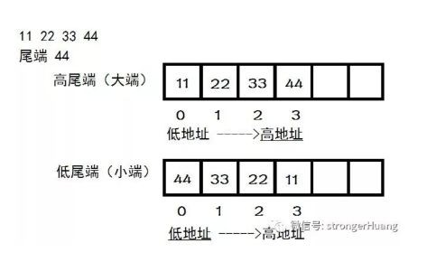

#### Java 字节和基础类型的转换

###### & 使用

   与 == 电路串联  
   * & 1 = *
   * & 0 = 0
   常用 & 0xff** 来获取 指定位置的 byte
    
    
###### | 使用

   | 相当于电路 并联
   * | 0  = *
   * | 1 = 1
   常用：
   常用于 byte << N || byte << M 来构成新的 值
    

#### 大小端

###### 大端
    
   低地址存储 高字节  高地址存储低字节
   内存地址 从低到高 使用
   
###### 小端
   高地址存储高字节  低地址存储低字节
   
   

